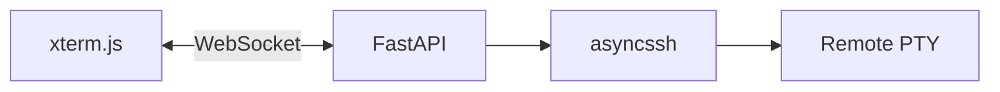

# SSH Terminal Bridge — Implementation

The web UI loads **xterm.js** in the browser and opens a **WebSocket** to this
server. The server uses **asyncssh** to connect to a remote host (credentials
from environment variables only), allocates a **PTY**, and copies I/O between
the WebSocket and the remote process so the user can run **Claude Code** (or
any shell) interactively on the remote machine.

## Architecture



### Key files

- [`app/ssh_terminal.py`](app/ssh_terminal.py) — Loads `SSH_*` settings from
  the environment, connects with a client key, builds the remote command
  (`build_remote_command_argv`), and runs `_bridge_loop` to copy bytes and
  handle `{"type":"resize","cols","rows"}` JSON messages from the client.
- [`app/main.py`](app/main.py) — Serves static UI, `GET /health`, and
  `WebSocket /ws/terminal`.
- [`app/static/`](app/static/) — HTML/CSS and client script that wires xterm
  to the WebSocket (binary frames for terminal data, text JSON for resize).

### Environment variables

| Variable | Required | Description |
|----------|----------|-------------|
| `SSH_HOST` | yes | Remote hostname or IP |
| `SSH_USER` | yes | SSH username |
| `SSH_PRIVATE_KEY_PATH` | yes | Path to private key on the server running uvicorn |
| `SSH_PORT` | no | Default `22` |
| `SSH_STRICT_HOST_KEY_CHECKING` | no | `yes`/`no` (default yes) |
| `SSH_KNOWN_HOSTS` | no | Path to known_hosts when strict checking is on |
| `SSH_REMOTE_COMMAND` | no | If set, remote runs `bash -lc` with this command after optional `ANTHROPIC_API_KEY` export |
| `ANTHROPIC_API_KEY` | no | If set without `SSH_REMOTE_COMMAND`, remote runs `bash -lc` that exports the key and `exec`s `CLAUDE_CODE_CMD` |
| `CLAUDE_CODE_CMD` | no | Default `claude` |
| `SSH_TERM_TYPE` | no | Default `xterm-256color` |
| `SSH_INITIAL_COLS` / `SSH_INITIAL_ROWS` | no | Initial PTY size before the client sends resize |

### Security

This service can reach any host the SSH key allows. Run it behind TLS, limit
network access, and treat the host like a bastion.

### nginx reverse proxy

Terminals use **`WebSocket /ws/terminal`**. nginx must forward **`Upgrade`** and
**`Connection`**; otherwise the browser shows WebSocket **1006** and Uvicorn logs
plain **`GET /ws/terminal` 404** (no upgrade reached the app).

1. Run the app on loopback only, e.g.  
   `uvicorn app.main:app --host 127.0.0.1 --port 8000`
2. Install nginx: either run **`bash deploy/setup-nginx.sh YOUR_IP_OR_DNS`** on the
   VM (writes and enables a site with WebSocket headers), or copy
   [`deploy/nginx-site.example.conf`](deploy/nginx-site.example.conf) to
   `/etc/nginx/sites-available/…` and set **`server_name`** (and DNS **A** record)
   when you use a domain.
3. **`sudo nginx -t`** then **`sudo systemctl reload nginx`**
4. TLS: install **Certbot** (`python3-certbot-nginx` or `certbot`), obtain certs
   for `server_name`, then enable the **`listen 443 ssl`** `server` block in the
   example (and optionally redirect **80 → 443**).
5. Open **80** (and **443** if using HTTPS) in the cloud firewall; do **not**
   expose port **8000** publicly if Uvicorn stays on **127.0.0.1**.

If **`/health` works** but the UI shows **Disconnected (code 1006)** right after
**Connected**, the WebSocket upgrade is fine; check **Uvicorn logs** for a Python
traceback (SSH / PTY errors used to drop the socket without a clean close). The
site examples set **`proxy_buffering off`** and **`gzip off`** on `/` to avoid
nginx interfering with binary WebSocket frames.

### Tests

```bash
python3 -m pip install -r requirements.txt
python3 -m pytest tests/ -q
```
