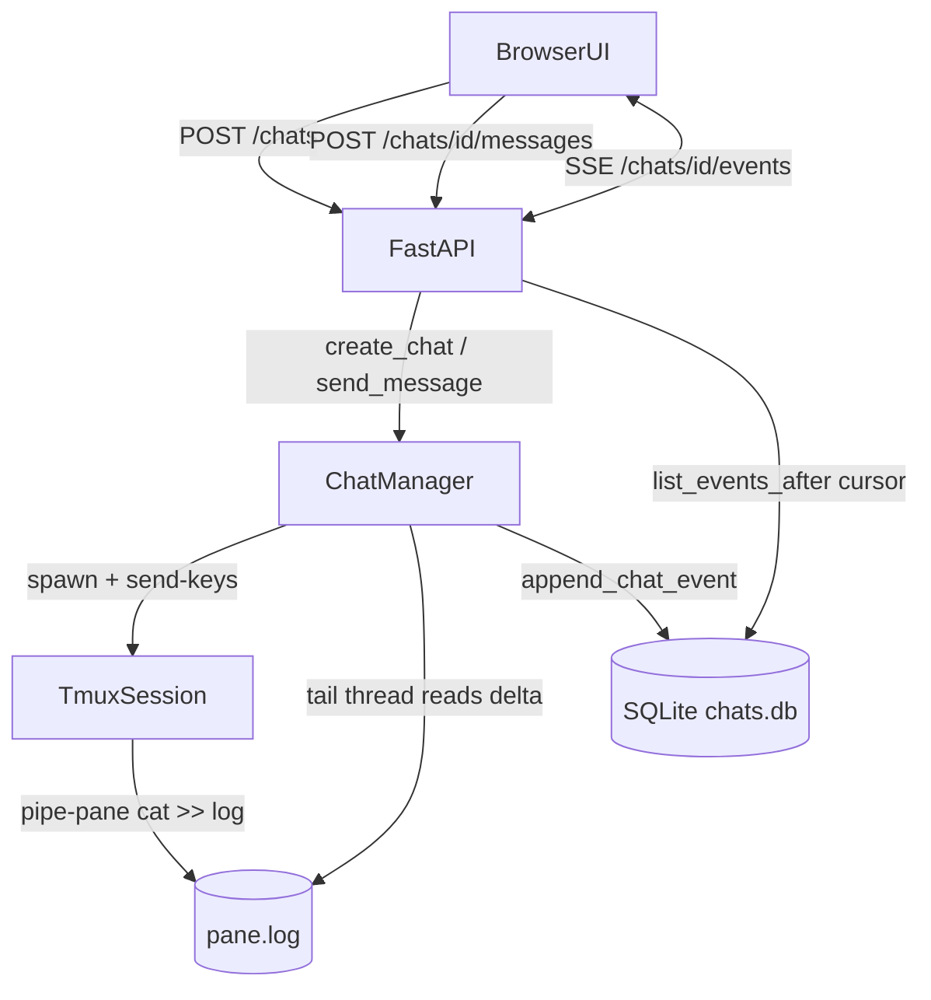

# Tmux-Backed Claude Code Bridge — Implementation & GCP Deployment

This document explains what was built, how the pieces fit together, how to
run and test it locally, and how to deploy it to Google Cloud Platform.

## What Changed vs. the Old API-Driven Loop

The previous implementation used the Anthropic HTTP API inside a blocking
agent loop and surfaced only the final answer via job polling. It has been
replaced with a long-lived Claude Code process running inside a tmux session
per chat. The server injects user input into the pane and streams pane
output back to the browser.

Removed modules: `app/agent.py`, `app/claude.py`, `app/worker.py`,
`app/tools.py`, `app/prompt.py`, `app/telegram_bot.py`, `app/jobs.db`.

## Architecture



### Key files

- `app/tmux_session.py` — Thin wrapper around `tmux` CLI. Uses
  `new-session -d`, `pipe-pane -o`, `load-buffer -` (stdin), `paste-buffer`,
  and `send-keys C-m`, mirroring the patterns in
  `scripts/tmux-monitor.sh` and `sleeping-claude-readme.md`. Every tmux
  invocation flows through a single `runner` callable so tests can swap in
  a fake tmux world.
- `app/chat_session.py` — `ChatManager` owns per-chat tmux sessions. On
  `create_chat()` it spawns the session, starts pipe-pane into a log file,
  launches the configured Claude Code command (`CLAUDE_CODE_CMD`, default
  `claude`), and starts a daemon thread that tails the log, strips ANSI
  escapes, and writes `assistant` events to SQLite. `send_message` is
  serialized by a per-chat lock so concurrent prompts do not interleave.
- `app/state.py` — SQLite schema with `chats` and `chat_events` (append-only
  event log with autoincrementing `id`). `list_events_after(chat_id,
  after_id)` lets the SSE endpoint resume after disconnects.
- `app/main.py` — FastAPI endpoints:
  - `POST /chats` — create a chat + tmux session.
  - `POST /chats/{id}/messages` — inject text into the pane.
  - `GET /chats/{id}/events` — SSE stream (`id:`, `event:`, `data:`) of new
    events, replaying from `?after_id=` for reconnects. Emits an `end`
    event once the chat is no longer active.
  - `GET /chats/{id}` — history snapshot for resuming from the browser.
  - `DELETE /chats/{id}` — tear the session down.
  - `GET /health` — liveness probe.
- `app/static/` — Browser UI with `EventSource` that streams assistant
  output into a live bubble and persists the chat id in `localStorage`.

### Event flow for one prompt

1. Browser `POST /chats/{id}/messages` with the prompt text.
2. FastAPI calls `ChatManager.send_message`.
3. Manager appends a `user` event to SQLite, then calls
   `TmuxSession.send_text(...)` which does `load-buffer` + `paste-buffer`
   + `send-keys C-m`.
4. Claude Code, running in the pane, responds; every byte it writes is
   duplicated by `pipe-pane` into the session's log file.
5. The tail thread reads new bytes from the log, strips ANSI, and writes
   `assistant` events.
6. The SSE endpoint polls `list_events_after(after_id=cursor)` and
   forwards each new row as an SSE message to the browser, where the UI
   appends it to the live assistant bubble.

### Design decisions (captured from the plan)

- **Persistent session per chat.** Claude Code's context is preserved
  across prompts because we reuse the tmux pane.
- **SSE for streaming.** Single-direction, works through any HTTP-capable
  proxy (including Cloud Run). Reconnects are supported via `?after_id=`
  because events live in SQLite.
- **SQLite as source of truth.** No in-memory pub/sub is required; tail
  thread writes, SSE endpoint reads.
- **All tmux calls pass through a `runner` abstraction.** Tests use a
  fake tmux world that emulates pipe-pane into a real file, so we can
  assert on the full flow without a tmux binary.

## Running Locally

Install tmux and Python dependencies:

```bash
# macOS
brew install tmux

# Debian / Ubuntu
sudo apt-get install -y tmux

python3 -m venv .venv
source .venv/bin/activate
pip install -r requirements.txt
```

Install Claude Code itself and make sure `claude` is on `PATH`, or set
`CLAUDE_CODE_CMD` to whatever command starts it in your environment.

Start the server:

```bash
./scripts/start.sh
# Browser: http://127.0.0.1:8000
```

Environment variables the app reads:

| Variable | Default | Purpose |
|----------|---------|---------|
| `CLAUDE_CODE_CMD` | `claude` | Command injected as the first line in each tmux session. |
| `TMUX_SESSION_PREFIX` | `claude-chat-` | Prefix for tmux session names. |
| `TMUX_LOG_DIR` | `/tmp/claude-chat-logs` | Where pane logs are written by `pipe-pane`. |
| `CHAT_DB_PATH` | `app/chats.db` | SQLite file holding chats + events. |
| `PORT` | `8000` | Port the start script binds to. |

## Testing

```bash
pip install pytest
python -m pytest tests/ -v
```

Test layout (`tests/`):

- `test_tmux_session.py` — verifies the start → pipe-pane → paste-buffer →
  send-keys sequence and error handling using an in-memory fake tmux.
- `test_state.py` — SQLite schema: chats CRUD, append-only event log,
  cursor-based tailing, per-chat scoping.
- `test_chat_session.py` — `ChatManager` integration: session spawn,
  prompt injection, tail thread streaming assistant events, concurrent
  sends serialized, ANSI stripping, shutdown.
- `test_api.py` — FastAPI TestClient against every endpoint including
  the SSE stream (including the "emit end on inactive" behaviour).

All tests use `conftest.py`'s `FakeTmuxWorld`, which emulates `pipe-pane`
by appending injected text to the session's log file — exactly what a
real tmux server does — so the ChatManager tail thread exercises real
file I/O without requiring tmux to be installed.

## Deploying on GCP

Because the server spawns long-lived tmux processes and streams SSE, a
container VM (Compute Engine) is the simplest fit. Cloud Run also works
but note the caveats at the end of this section.

### Option A — Compute Engine (recommended)

1. **Create the VM**

    ```bash
    gcloud compute instances create claude-bridge \
      --zone=us-central1-a \
      --machine-type=e2-small \
      --image-family=debian-12 \
      --image-project=debian-cloud \
      --tags=http-server \
      --metadata=enable-oslogin=TRUE
    ```

2. **Open port 80/443** if you plan to expose directly (for demos only;
   production should sit behind a load balancer + IAP):

    ```bash
    gcloud compute firewall-rules create allow-bridge-http \
      --allow=tcp:80,tcp:443 \
      --target-tags=http-server
    ```

3. **Bootstrap the VM** (SSH in, then):

    ```bash
    sudo apt-get update
    sudo apt-get install -y tmux git python3-venv nginx
    # Install Node (required by Claude Code CLI)
    curl -fsSL https://deb.nodesource.com/setup_20.x | sudo -E bash -
    sudo apt-get install -y nodejs
    sudo npm install -g @anthropic-ai/claude-code

    git clone <your-repo> ~/app && cd ~/app
    python3 -m venv .venv
    .venv/bin/pip install -r requirements.txt
    ```

    Configure Claude Code once as the runtime user so the tmux session
    picks up the auth:

    ```bash
    claude login   # follow the device flow
    ```

4. **Systemd unit** — `/etc/systemd/system/claude-bridge.service`:

    ```ini
    [Unit]
    Description=Claude tmux bridge
    After=network.target

    [Service]
    User=ubuntu
    WorkingDirectory=/home/ubuntu/app
    Environment=TMUX_LOG_DIR=/var/log/claude-bridge
    Environment=CHAT_DB_PATH=/home/ubuntu/app/chats.db
    ExecStart=/home/ubuntu/app/.venv/bin/uvicorn app.main:app --host 127.0.0.1 --port 8000
    Restart=on-failure

    [Install]
    WantedBy=multi-user.target
    ```

    ```bash
    sudo mkdir -p /var/log/claude-bridge && sudo chown ubuntu /var/log/claude-bridge
    sudo systemctl daemon-reload
    sudo systemctl enable --now claude-bridge
    ```

5. **Nginx reverse proxy with SSE pass-through** — `/etc/nginx/sites-available/claude-bridge`:

    ```nginx
    server {
      listen 80;
      server_name _;

      location / {
        proxy_pass http://127.0.0.1:8000;
        proxy_http_version 1.1;
        proxy_set_header Connection "";
        proxy_buffering off;          # critical for SSE
        proxy_read_timeout 3600s;
        proxy_set_header X-Accel-Buffering no;
      }
    }
    ```

    ```bash
    sudo ln -s /etc/nginx/sites-available/claude-bridge /etc/nginx/sites-enabled/
    sudo nginx -t && sudo systemctl reload nginx
    ```

6. **TLS (optional)** — `sudo apt install certbot python3-certbot-nginx &&
   sudo certbot --nginx -d your.domain`.

### Option B — Cloud Run (container)

Cloud Run can work because it allows long-running streaming responses up
to 60 minutes per request, but:

- The container must ship `tmux` and Claude Code.
- CPU must be set to "always allocated"; the tail thread must keep
  running between requests.
- Cloud Run filesystems are ephemeral and per-instance. If you need
  sessions to survive restarts, mount a Filestore / GCS FUSE volume for
  the log directory and store the SQLite DB on Filestore as well.
- Auto-scaling to N > 1 does not share in-memory `ChatManager` state.
  Pin to `--max-instances=1` (or shard chats by instance) if you need
  multiple workers.

Minimal `Dockerfile`:

```dockerfile
FROM python:3.12-slim

RUN apt-get update \
 && apt-get install -y --no-install-recommends tmux curl ca-certificates \
 && curl -fsSL https://deb.nodesource.com/setup_20.x | bash - \
 && apt-get install -y nodejs \
 && npm install -g @anthropic-ai/claude-code \
 && rm -rf /var/lib/apt/lists/*

WORKDIR /app
COPY requirements.txt ./
RUN pip install --no-cache-dir -r requirements.txt
COPY . .

ENV TMUX_LOG_DIR=/tmp/claude-chat-logs \
    CHAT_DB_PATH=/app/chats.db \
    PORT=8080

EXPOSE 8080
CMD ["sh", "-c", "uvicorn app.main:app --host 0.0.0.0 --port ${PORT}"]
```

Build and deploy:

```bash
PROJECT=your-project
REGION=us-central1

gcloud builds submit --tag gcr.io/$PROJECT/claude-bridge

gcloud run deploy claude-bridge \
  --image gcr.io/$PROJECT/claude-bridge \
  --region $REGION \
  --allow-unauthenticated \
  --cpu-always-allocated \
  --timeout=3600 \
  --max-instances=1 \
  --memory=1Gi
```

Claude Code's OAuth token must be baked in or mounted via a Secret
Manager secret; one approach is to mount the credentials file at
`/root/.claude/` using the Cloud Run "secrets as volumes" feature.

### Production caveats

- `ChatManager` state is in-memory — do not run multiple replicas without
  sticky routing.
- `capture-pane` / log-tailing gives you pane bytes, not structured
  messages. If you need to render Claude Code's tool/use blocks natively,
  replace the log parser with Claude Code's JSON streaming output mode.
- Terminate idle chats: add a periodic sweeper that calls
  `ChatManager.stop_chat` on chats whose `chat_events` have been silent
  for N minutes so tmux processes don't accumulate.
- Protect the API — this app executes arbitrary user input inside a tmux
  pane. Gate the routes behind authentication (IAP, OAuth2 proxy, or a
  simple API key) before exposing it to the public internet.
