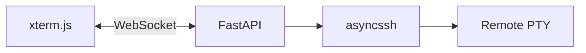

# SSH Terminal Bridge — Implementation

The web UI loads **xterm.js** in the browser and opens a **WebSocket** to this
server. The server uses **asyncssh** to connect to a remote host (credentials
from environment variables only), allocates a **PTY**, and copies I/O between
the WebSocket and the remote process so the user can run **Claude Code** (or
any shell) interactively on the remote machine.

## Architecture



### Key files

- [`app/ssh_terminal.py`](app/ssh_terminal.py) — Loads `SSH_*` settings from
  the environment, connects with a client key, builds the remote command
  (`build_remote_command_argv`), and runs `_bridge_loop` to copy bytes and
  handle `{"type":"resize","cols","rows"}` JSON messages from the client.
- [`app/main.py`](app/main.py) — Serves static UI, `GET /health`, and
  `WebSocket /ws/terminal`.
- [`app/static/`](app/static/) — HTML/CSS and client script that wires xterm
  to the WebSocket (binary frames for terminal data, text JSON for resize).
- [`app/token.py`](app/token.py) — Redis-backed token storage, validation, and
  TTL management. Tokens store role, access type, and metadata.

## Authentication & Token System

Access to the web UI and terminal is gated by **tokens**. The server validates
tokens against **Redis**, enforcing **role-based access control**:

Deployment owners can also authenticate through the Intelligence3 parent app.
The parent sends a Firebase ID token to the embedded Claude Code page with
`postMessage`; the backend verifies the token UID against `CLAUDE_OWNER_UID`
and creates a short-lived HttpOnly, Secure, Partitioned Redis-backed session.

- **`owner`** tokens: full access (terminal, token management).
- **`administrator`/`admin`** tokens: same as owner.
- **`guest` + `viewer`** tokens: read-only; blocked from opening a terminal.
- **`guest` + `editor`** tokens: terminal access (future use).

### Token lifecycle

1. An **owner** user creates a **guest token** via the web UI (**POST `/api/tokens`**).
2. The server stores the token in Redis with a TTL (time-to-live) and role metadata.
3. The guest can use the token in the URL (`?claudecodeToken=...`) or header
   (`X-Claude-Code-Token: ...`) to access the UI.
4. When connecting to the terminal (**WebSocket `/ws/terminal`**), the server:
   - Validates the token (must exist, be active, and not expired).
   - **Blocks viewer-role tokens** from opening the terminal (WebSocket closes with
     error code `4403`).
   - Allows owner/admin/editor tokens to proceed.
5. The **owner** can revoke a token at any time (**DELETE `/api/tokens/{token}`**).

### API Endpoints

| Method | Path | Auth | Description |
|--------|------|------|-------------|
| `GET` | `/` | token | Serve UI (redirects to `rejected.html` if no valid token) |
| `GET` | `/health` | none | Health check |
| `GET` | `/api/tokens` | owner/admin | List all tokens |
| `POST` | `/api/tokens` | owner/admin | Create a new guest token |
| `DELETE` | `/api/tokens/{token}` | owner/admin | Revoke a token |
| `WebSocket` | `/ws/terminal` | token (no viewer) | PTY bridge (denied for viewer-role guests) |

### Token metadata fields

```json
{
  "token": "hex64string",
  "role": "owner|guest",
  "status": "active|revoked",
  "accessType": "viewer|editor",
  "createdAt": "2026-05-14T12:30:00Z",
  "createdBy": "owner_token_hash",
  "deploymentId": "optional_string",
  "ownerDeploymentId": "optional_string",
  "ttlSeconds": 3600,
  "expiresAt": "2026-05-14T13:30:00Z"
}
```

### Environment variables

| Variable | Required | Description |
|----------|----------|-------------|
| `SSH_HOST` | yes | Remote hostname or IP |
| `SSH_USER` | yes | SSH username |
| `SSH_PRIVATE_KEY_PATH` | yes | Path to private key on the server running uvicorn |
| `SSH_PORT` | no | Default `22` |
| `SSH_STRICT_HOST_KEY_CHECKING` | no | `yes`/`no` (default yes) |
| `SSH_KNOWN_HOSTS` | no | Path to known_hosts when strict checking is on |
| `SSH_REMOTE_COMMAND` | no | If set, remote runs `bash -lc` with this command after optional `ANTHROPIC_API_KEY` export |
| `ANTHROPIC_API_KEY` | no | If set without `SSH_REMOTE_COMMAND`, remote runs `bash -lc` that exports the key and `exec`s `CLAUDE_CODE_CMD` |
| `CLAUDE_CODE_CMD` | no | Default `claude` |
| `SSH_TERM_TYPE` | no | Default `xterm-256color` |
| `SSH_INITIAL_COLS` / `SSH_INITIAL_ROWS` | no | Initial PTY size before the client sends resize |
| `CLAUDE_CODE_REDIS_URL` | no | Redis connection string; default `redis://127.0.0.1:6379` |
| `FIREBASE_PROJECT_ID` | yes for Google owner login | Firebase project used to verify ID tokens |
| `CLAUDE_OWNER_UID` | yes for Google owner login | Firebase UID that owns this deployment |
| `CLAUDE_SESSION_COOKIE_SECURE` | no | Secure session cookie toggle; default `true` |

### Client-side token management

The web UI provides a **token management panel** (visible to owner/admin tokens only):

- **Create guest token** — Select access type (`viewer` or `editor`) and TTL
  (minutes, hours, or days), then create. The resulting **shareable link** 
  (`https://<host>/claudecode/?claudecodeToken=...`) is displayed once and can
  be copied with a single click.
- **Token list** — Shows all active and revoked tokens with their role, access
  type, creation date, and TTL. Each token has **Copy** (copies shareable link)
  and **Revoke** buttons.
- **Auto-refresh** — Token list refreshes every 3 seconds while the panel is
  visible, so revoked or expired tokens appear up-to-date.

### Security

This service can reach any host the SSH key allows. Run it behind TLS, limit
network access, and treat the host like a bastion.

**Token & Redis security:**

- Tokens are stored in **Redis** with an automatic TTL; expired tokens are
  automatically deleted.
- Always run Redis **behind a firewall** and restrict network access to the
  application server only (do not expose Redis publicly).
- Use **strong, unique tokens** (the server generates 32-byte hex strings).
- **Viewer-role tokens** are explicitly **blocked from terminal access** at the
  WebSocket layer (error code `4403`), preventing privilege escalation.
- Owner tokens should be treated like passwords; consider rotating them
  periodically or using short-lived token chains.

### nginx reverse proxy

Terminals use **`WebSocket /ws/terminal`**. nginx must forward **`Upgrade`** and
**`Connection`**; otherwise the browser shows WebSocket **1006** and Uvicorn logs
plain **`GET /ws/terminal` 404** (no upgrade reached the app).

1. Run the app on loopback only, e.g.  
   `uvicorn app.main:app --host 127.0.0.1 --port 8000`
2. Install nginx: either run **`bash deploy/setup-nginx.sh YOUR_IP_OR_DNS`** on the
   VM (writes and enables a site with WebSocket headers), or copy
   [`deploy/nginx-site.example.conf`](deploy/nginx-site.example.conf) to
   `/etc/nginx/sites-available/…` and set **`server_name`** (and DNS **A** record)
   when you use a domain.
3. **`sudo nginx -t`** then **`sudo systemctl reload nginx`**
4. TLS: install **Certbot** (`python3-certbot-nginx` or `certbot`), obtain certs
   for `server_name`, then enable the **`listen 443 ssl`** `server` block in the
   example (and optionally redirect **80 → 443**).
5. Open **80** (and **443** if using HTTPS) in the cloud firewall; do **not**
   expose port **8000** publicly if Uvicorn stays on **127.0.0.1**.

If **`/health` works** but the UI shows **Disconnected (code 1006)** right after
**Connected**, the WebSocket upgrade is fine; check **Uvicorn logs** for a Python
traceback (SSH / PTY errors used to drop the socket without a clean close). The
site examples set **`proxy_buffering off`** and **`gzip off`** on `/` to avoid
nginx interfering with binary WebSocket frames.

### Tests

```bash
python3 -m pip install -r requirements.txt
python3 -m pytest tests/ -q
```
